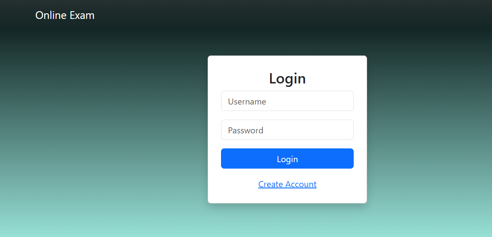
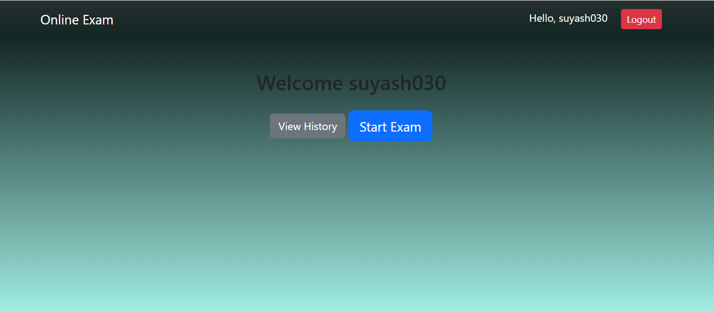
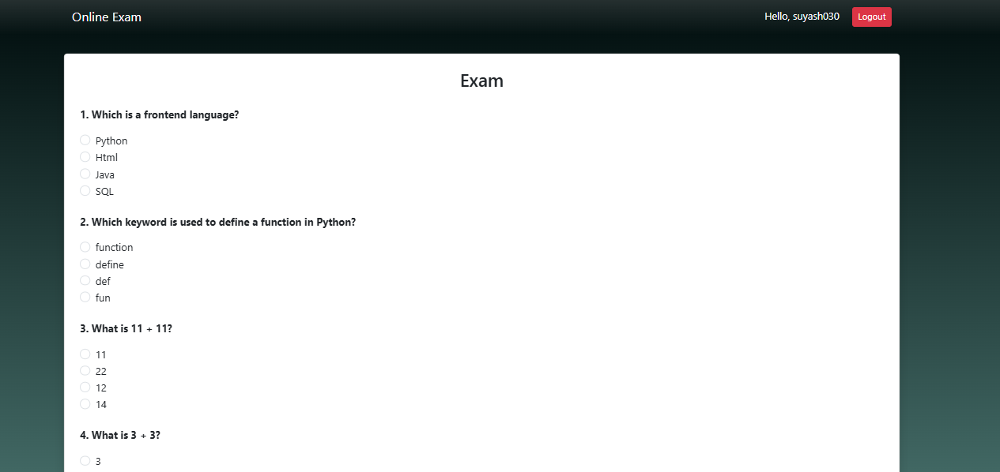
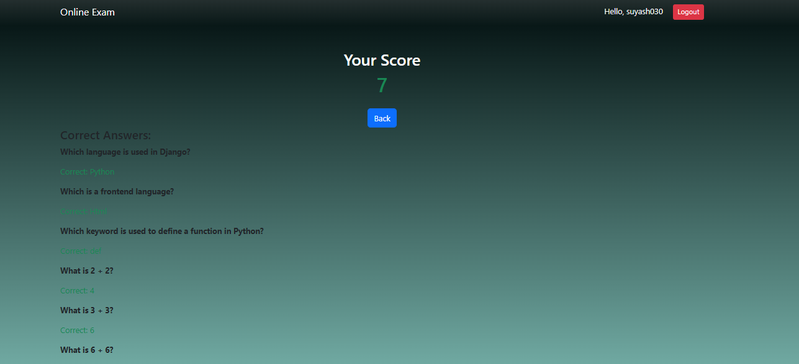

# 🚀 SmartExam – Online Assessment Platform

A full-stack Django web application that allows users to take online exams with automated evaluation and performance tracking.

---

## ✨ Features

- 🔐 User Authentication (Login/Register)
- 🎲 Randomized Question Generation
- ⏱️ Timer-based Exam Submission
- 📊 Automatic Scoring System
- 📈 Result History Tracking
- 🏆 Leaderboard System

---

## 🛠️ Tech Stack

- **Backend:** Django (Python)
- **Frontend:** HTML, CSS, Bootstrap
- **Database:** SQLite

---

## Screenshots

### Login Page

### Student Dashboard

### Exam Interface

### Result Page

git clone https://github.com/Suyash030/SmartExam.git
cd SmartExam
pip install django
python manage.py migrate
python manage.py runserver
